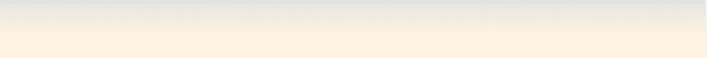

# DESK YOGIS

---

Deskyogis.com is a site for people who spend several hours per day sitting still in front of a screen.
Site visitors will find exercises for both body and mind. 
Yoga exercises for the body that can be preformed sitting down at a desk.
And guided meditations for the mind that also can be preformed sitting at a desk.
Visitors can also sign up for our newsletter to get more guided meditations and yoga exercises.
To have both guided meditations and yoga exercises on the sam page creates value to the visitor and helps the visitor to make the most of their breaks at work. 

## Features

- Navigation and header
    - The navigation can be found in the header section at the top of the page to the right in the header. The links go to all pages index.html (Home), exercise.html and mindfulness.html
    - The page you are on is underlined in the navigation links
    - The title of the page is to the left in the navigation header and is linked to index.html
    - Other links can be found in the text blocks on all pages when references to other sections is mentioned
    - The navigation header is white on all pages to differentiate it from the rest of the page

- Hero image and cover text
    - Hero image is a woman stretching at a desk to convey what the site is about in one picture
    - An animation emerges to catch the visitors eye with what can be found on the site
    - Under the hero image a banner is shown with a fact that shows how important breaks are
    - Colors from the hero picture fades into the banner underneath

# Site content section and about us
 - Site content section consists of:
    - About us "Make the most of your break" which explains what visitors can find on the site
    - Info about desk yoga exercises and why they are useful
    - Info about guided meditations and why they are useful and what the benefits can be
    - The site conten section is Valuble to a visitor because it summarises what they can find on the site and where and who is are the target audience
 

# Newsletter section
- Contains a sign up form so visitos can submit their email adress
- No server is set up to receive the email adresses yet so an error is returned 
- The newsletter brings value to visitors by sending them new exercises and guided meditations

# Contact section
- The contact section shows users how they can get in contact with us via email, Instagram, Twitter, Facebook and Youtube
- All links open up in a new browser tab. Except for the email symbol that opens a mail client window installed on the operating system of the visitor
- The contact section creates value for the visitor because it shows how to get in touch, get more information and join our community on other platforms
- The contact section does not have any text, just icons, that clearly shows what visitors can expect if clicked.

# Top and bottom banner
- Top and bottom banners are divs that are used for fading colors background-colors together to avoid sharp color changes

# Testing
- The site is tested so it is looks good in different browsers such as: Safari, Chrome and Fire fox
- All internal links are tested and all external links are tested so that they opens in new tabs
- The sign up form is tested so that it only accepts a correct email adress
- Responsiveness:
    - I have confirmed that the all pages are responsive on all standard screens using dev tools device toolbar
    - Index.html and exercises.html have their pictures that belong to the text to the right. When screen width goes under 950px they all become block elements instead and show underneath each other.
    - The header with navigation will show the nav-links underneath the page title when the screen is under 950px. Instead of to the right on wider screens

## Pictures of the responsive design on index.html

  

# Bugs
   
## Solved Bugs
- The footer with the contact section did not show on the other pages, only index.html
    - Fix: I did not import the script from fontawsome.com on the other pages. And because the contact section consist only of icons it did not show anything.
- I couldn´t get the iframes of the Youtube videos to show anything:
    - Fix: I inserted the url to the Youtube clip in the src="" attribute but I later realized that I had to paste the entire imbeded code from the "Share" function on Youtube 
- The wrapper for the text section on index.html was either too long or too short for its content
    - Fix: I contacted a CI tutor and he said to add display: flex ; to the wrapper and height 100% to the divs inside to make it the same height and responsive    

## Unfixed bugs
- No unfixed bugs

# Validator testing

- HTML validator
    - No errors returned using W3C validator "https://validator.w3.org/"
    

- Css validator
    - No errors returned using Jigsaw "https://jigsaw.w3.org/"

- Lighthouse and Accessibility
    - Passed through lighthouse test with high score in every category

---

# Deployment

- The site was deployed on git hub in these steps
- Go to settings of your repository on git hub
- Scroll down to "pages" section 
- Choose main branch under the source drop down menu, then press save and the link is produced.
- This is the link to the site: https://mtssamsioe.github.io/desk-yogis/index.html

# Atribution

- Css and html help
    - https://www.w3schools.com
- Yoga videos Goodful channel on Youtube https://www.youtube.com/c/Goodful

## Content
- Footer and navigation header are inspired by walkthrough project CI "Love running"
- Text about mindfulness
    - https://www.mayoclinic.org/tests-procedures/meditation/in-depth/meditation/art-20045858

## Media
- Imgages are taken from https://www.shutterstock.com/
- Icons are taken from fontawsome.com
- Fonts are taken from googlefonts.com. I used Antonio for the headers and Arvo font-weight 400 and 700 for the text.

---

# Mockups and wireframes

## Early wire frame desktop

### index.html 

### exercises.html 

 

### mindfulness.html 

## Early wire frame mobile

  